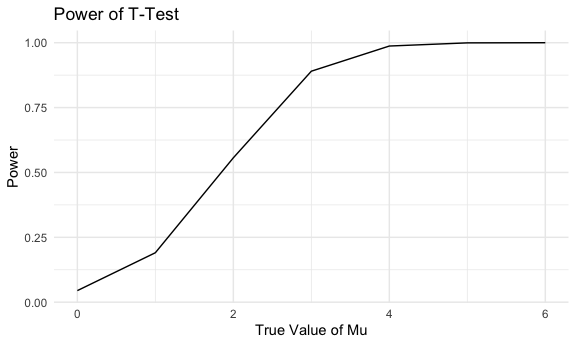

hw5
================
Yan Li
2024-11-13

# Problem 1

## Birthday Function

``` r
bday_dupes = function(n) {

  bdays = sample(1:365, size = n, replace = TRUE)
  
  has_dupe = any(duplicated(bdays))
  
  return(has_dupe)
}
```

## Run function for different group size

``` r
set.seed(123)
results = map_df(2:50, function(n) {
  dupes = map_lgl(1:10000, ~ bday_dupes(n))
  prob = mean(dupes)
  tibble(group_size = n, prob = prob)
})
```

## Plot

``` r
ggplot(results, aes(x = group_size, y = prob)) +
  geom_line() +
  labs(
    title = "Problem 1:Birthday Function",
    x = "Group Size",
    y = "Probability of Shared Birthday"
  )
```

 -
The probability of shared birthday increases as the group size
increases, and the growth in probability is nonlinear.

# Problem 2

## t-test

``` r
set.seed(123)
n = 30
sigma = 5
mu_vals = 0:6

get_p_values = function(mu) {
  map_dbl(1:5000, ~ {
    x = rnorm(n, mean = mu, sd = sigma)
    t_test = t.test(x, mu = 0)
    broom::tidy(t_test)$p.value
  })
}

power_results = map_df(mu_vals, function(mu) {
  p_vals = get_p_values(mu)
  power = mean(p_vals < 0.05)
  return(tibble(mu = mu, power = power))
})

power_results
```

    ## # A tibble: 7 × 2
    ##      mu  power
    ##   <int>  <dbl>
    ## 1     0 0.0446
    ## 2     1 0.191 
    ## 3     2 0.556 
    ## 4     3 0.890 
    ## 5     4 0.987 
    ## 6     5 0.999 
    ## 7     6 1

## Plot Power

``` r
ggplot(power_results, aes(x = mu, y = power)) +
  geom_line() +
  labs(
    title = "Power of T-Test",
    x = "True Value of Mu",
    y = "Power"
  )
```

 -
The plot shows a positive relationship between effect size (mu) and
statistical power. As the effect size (mu) increases, the power of the
test also increases.

## Plot
