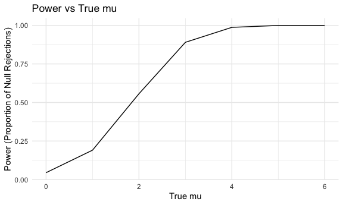

hw5
================
Yan Li
2024-11-13

# Problem 1

## Birthday Function

``` r
bday_dupes = function(n) {
  bdays = sample(1:365, size = n, replace = TRUE)
  has_dupe = any(duplicated(bdays))
  return(has_dupe)
}
```

## Run function for different group size

``` r
set.seed(123)
results = map_df(2:50, function(n) {
  dupes = map_lgl(1:10000, ~ bday_dupes(n))
  prob = mean(dupes)
  tibble(group_size = n, prob = prob)
})
```

## Plot

``` r
ggplot(results, aes(x = group_size, y = prob)) +
  geom_line() +
  labs(
    title = "Problem 1:Birthday Function",
    x = "Group Size",
    y = "Probability of Shared Birthday"
  )
```

 -
The probability of shared birthday increases as the group size
increases, and the growth in probability is nonlinear.

# Problem 2

## t-test

``` r
set.seed(123)
n = 30
sigma = 5
mu_values = c(0, 1, 2, 3, 4, 5, 6)
num_sim = 5000

run_sim = function(mu) {
  replicate(num_sim, {
    x = rnorm(n, mean = mu, sd = sigma)
    t_test = t.test(x, mu = 0)
    broom::tidy(t_test)
  }, simplify = FALSE) |>
    bind_rows() |>
    mutate(mu = mu)
}

simulations = map_df(mu_values, run_sim)
```

## Power and Estimate Mu

``` r
results_df = simulations |>
  group_by(mu) |>
  summarize(
    power = mean(p.value < 0.05),
    avg_mu_est = mean(estimate),
    avg_rej_mu_est = mean(estimate[p.value < 0.05], na.rm = TRUE)
  )

results_df
```

    ## # A tibble: 7 × 4
    ##      mu  power avg_mu_est avg_rej_mu_est
    ##   <dbl>  <dbl>      <dbl>          <dbl>
    ## 1     0 0.0446    0.00900          0.147
    ## 2     1 0.191     1.01             2.23 
    ## 3     2 0.556     1.99             2.60 
    ## 4     3 0.890     3.01             3.20 
    ## 5     4 0.987     3.98             4.01 
    ## 6     5 0.999     4.98             4.99 
    ## 7     6 1         5.99             5.99

## Plot 1: Power vs True mu

``` r
results_df |>
  ggplot(aes(x = mu, y = power)) +
  geom_line() +
  labs(
    title = "Power vs True mu",
    x = "True mu",
    y = "Power (Proportion of Null Rejections)"
  )
```

 -
The relationship between effect size and power is positive. As the
effect size increases, power also increases,

## Plot 2: Average estimate mu vs True mu

``` r
results_df |>
  ggplot(aes(x = mu)) +
  geom_line(aes(y = avg_mu_est), color = "blue") +
  geom_line(aes(y = avg_rej_mu_est), color = "red") +
  labs(
    title = "Average Estimate mu vs True mu",
    x = "True mu",
    y = "Average Estimate"
  )
```

 -
No, the sample average of estimate mu across tests for which the null is
rejected is not approximately equal to the true value of mu.The average
estimate mu is consistently higher than the true value of mu for the
cases where the null hypothesis was rejected.Because more samples reject
the null, including those closer to the true value, will lead to a
reduction in bias.So the red line becomes closer to the blue line as mu
increases.

# Problem 3

## Import Data

``` r
homicide = read_csv("./homicide-data.csv")
```

    ## Rows: 52179 Columns: 12
    ## ── Column specification ────────────────────────────────────────────────────────
    ## Delimiter: ","
    ## chr (9): uid, victim_last, victim_first, victim_race, victim_age, victim_sex...
    ## dbl (3): reported_date, lat, lon
    ## 
    ## ℹ Use `spec()` to retrieve the full column specification for this data.
    ## ℹ Specify the column types or set `show_col_types = FALSE` to quiet this message.

- This dataset has 52179 observations and 12 variables, it provides a
  detailed look at homicide incidents across various U.S. cities,
  including victim information (name, race, age, sex), location data
  (latitude, longitude, city, state), and the current status of the
  case.

## Create new variable

``` r
homicide_new = homicide |>
  mutate(city_state = paste(city, state, sep = ", "))
```

## Total homicides and unsolved homicides

``` r
total_homi = homicide_new |>
  group_by(city_state) |>
  summarize(
    total_homicides = n(),
    unsolved_homicides = sum(disposition %in% c("Closed without arrest", "Open/No arrest"))
  )

total_homi
```

    ## # A tibble: 51 × 3
    ##    city_state      total_homicides unsolved_homicides
    ##    <chr>                     <int>              <int>
    ##  1 Albuquerque, NM             378                146
    ##  2 Atlanta, GA                 973                373
    ##  3 Baltimore, MD              2827               1825
    ##  4 Baton Rouge, LA             424                196
    ##  5 Birmingham, AL              800                347
    ##  6 Boston, MA                  614                310
    ##  7 Buffalo, NY                 521                319
    ##  8 Charlotte, NC               687                206
    ##  9 Chicago, IL                5535               4073
    ## 10 Cincinnati, OH              694                309
    ## # ℹ 41 more rows

## Proportion of Homicides in Baltimore

``` r
baltimore = total_homi |>
  filter(city_state == "Baltimore, MD") |>
  summarise(
    prop_test = prop.test(unsolved_homicides, total_homicides) |> broom::tidy()
  ) |>
  unnest(prop_test) |>
  select(estimate, conf.low, conf.high) 

baltimore
```

    ## # A tibble: 1 × 3
    ##   estimate conf.low conf.high
    ##      <dbl>    <dbl>     <dbl>
    ## 1    0.646    0.628     0.663

- In Baltimore, MD, an estimated 64.6% of homicides remain unsolved,
  with a 95% confidence interval ranging from 62.8% to 66.3%.

## Proportion for Each City

``` r
city_porp = total_homi |>
  mutate(
    prop_result = purrr::map2(unsolved_homicides, total_homicides, ~ prop.test(x = .x, n = .y))
  ) |>
  mutate(
    prop_result = purrr::map(prop_result, broom::tidy)
  ) |>
  unnest(prop_result) |>
  select(city_state, estimate, conf.low, conf.high)
  
city_porp
```

    ## # A tibble: 51 × 4
    ##    city_state      estimate conf.low conf.high
    ##    <chr>              <dbl>    <dbl>     <dbl>
    ##  1 Albuquerque, NM    0.386    0.337     0.438
    ##  2 Atlanta, GA        0.383    0.353     0.415
    ##  3 Baltimore, MD      0.646    0.628     0.663
    ##  4 Baton Rouge, LA    0.462    0.414     0.511
    ##  5 Birmingham, AL     0.434    0.399     0.469
    ##  6 Boston, MA         0.505    0.465     0.545
    ##  7 Buffalo, NY        0.612    0.569     0.654
    ##  8 Charlotte, NC      0.300    0.266     0.336
    ##  9 Chicago, IL        0.736    0.724     0.747
    ## 10 Cincinnati, OH     0.445    0.408     0.483
    ## # ℹ 41 more rows

## PLOT

``` r
ggplot(city_porp, aes(x = reorder(city_state, estimate), y = estimate, color = city_state)) +
  geom_point() +
  geom_errorbar(aes(ymin = conf.low, ymax = conf.high), width = 0.3) +
  coord_flip() +
  labs(
    title = "Proportion of Unsolved Homicides by City",
    x = "City",
    y = "Proportion of Unsolved Homicides"
  ) +
  theme(legend.position = "none")
```


